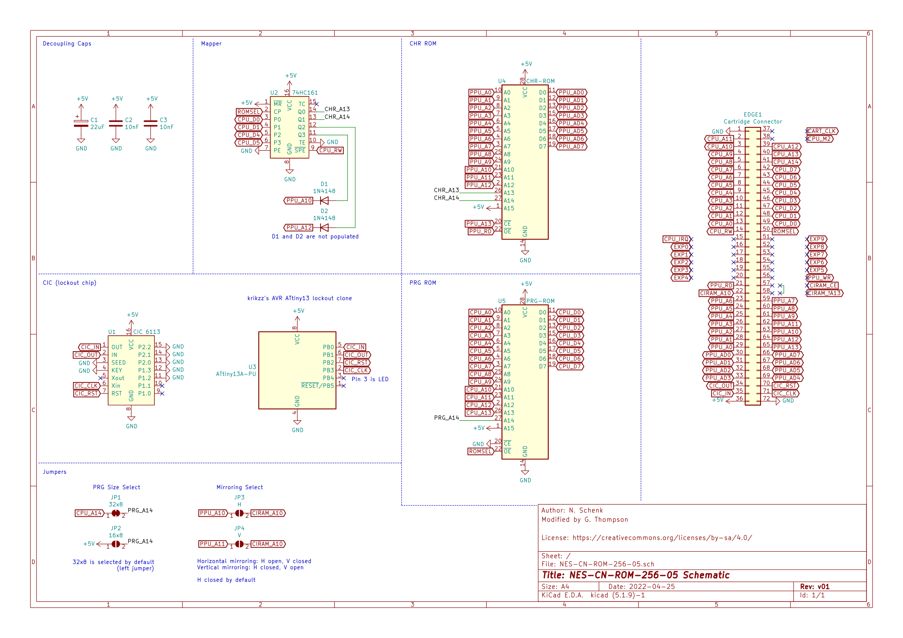
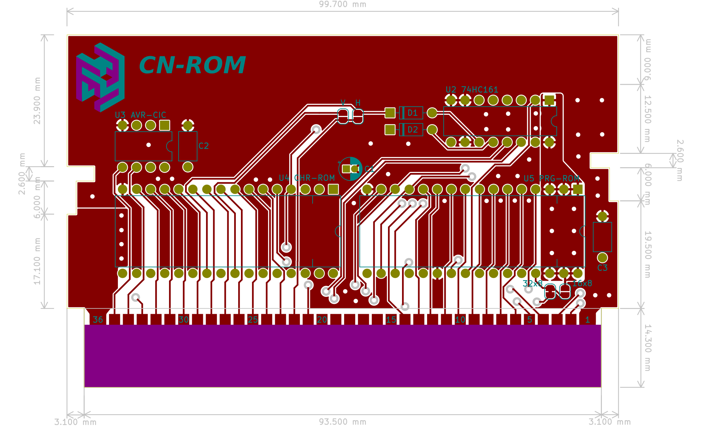
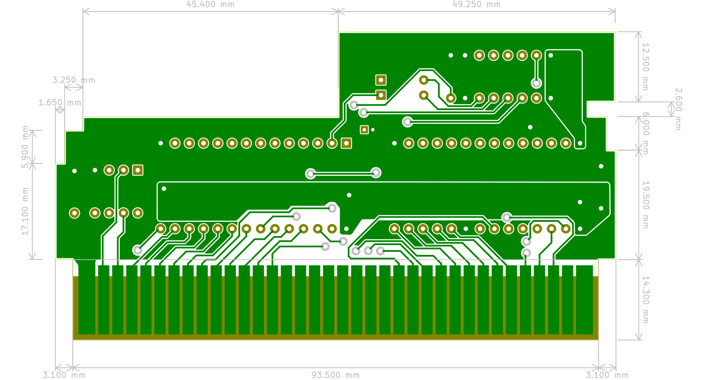
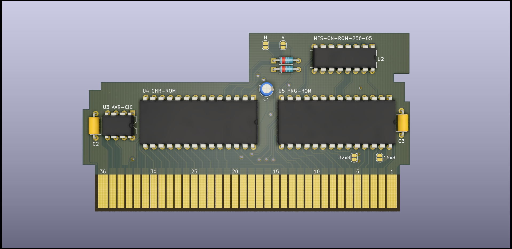

# nes-cnrom
[![CC BY-SA 4.0][cc-by-sa-shield]][cc-by-sa]

[cc-by-sa]: http://creativecommons.org/licenses/by-sa/4.0/
[cc-by-sa-shield]: https://img.shields.io/badge/License-CC%20BY--SA%204.0-lightgrey.svg

This repository contains a KiCad project for a NES-CN-ROM-256-05 cartridge pcb.

Original NES-CN-ROM-256-05 schematic is from N. Schenk's [NES repo](https://github.com/schenkzoola/NES/tree/main/Cartridges/NES/NES-CN-ROM-256-05). The schematic was modified to include currently available parts and their associated footprints.

The board matches the dimensions of the original and will idealy fit in standard or reproduction shells. A list of parts to populate the board can be found in the bom directory.

## Schematic

## Board Layout
Top | Bottom
:---: | :---:
 | 

Board render (front):

## Changelog

### [v01.1]
- Connected pins 57 and 58 on the cartridge edge connector for internal VRAM enable.

### [v01]
- Initial schematic and board layout.

[v01.1]: https://github.com/emeargt/nes-cnrom/releases/tag/v01.1
[v01]: https://github.com/emeargt/nes-cnrom/releases/tag/v01-alpha