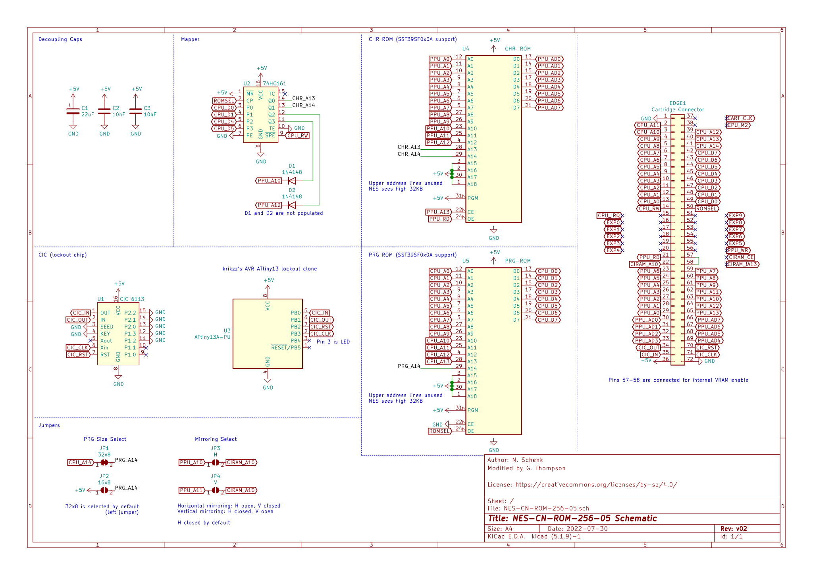

# nes-cnrom
This repository contains a KiCad project for a NES-CN-ROM-256-05 cartridge pcb.

The board matches the dimensions of the original and will idealy fit in standard or reproduction shells. A list of parts to populate the board can be found in the bom directory.

## Schematic

## Board Layout
Top | Bottom
:---: | :---:
 | 

Board render (front):

## Changelog

### v01
* Initial schematic and board layout
