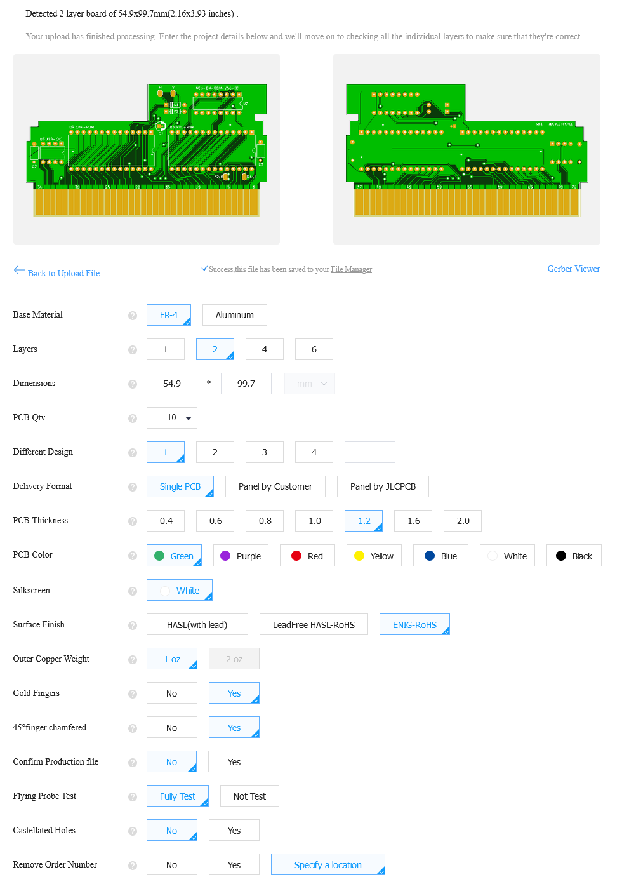

<a id="top"></a>

# Build Guide

This document contains a loose build guide on how to order a board/parts, program the necessary chips, and populate the board.

**Contents**<br>
[Part Ordering](#part-ordering)<br>
[Programming ICs](#programming-ics)<br>
[Populating the board](#populating-the-board)<br>
[Additional Resources](#additional-resources)<br>


## Part Ordering

### PCB
The production files (gerbers) in this repository were generated according to JLCPCB specifications. Therefore, ordering a small quantity run of boards from JLCPCB will be used as an example for this guide. To fabricate boards at a different manufacturer, the gerbers should be regenerated from the KiCad project before ordering.

Grab the zip of gerbers from the [latest board release](https://github.com/emeargt/nes-cnrom/releases). Alternatively, you find the latest gerbers in the [gerber directory](../gerber/) at the git repo head. These are the production files you will need to provide JLCPCB to have the board manufactured.

Upload the gerber zip on the [JLCPCB website](https://jlcpcb.com/) and choose the following settings:<br>


The important settings to note are
- *1.2mm thickness*: this is the thickness of original NES cartridge PCBs.
- *ENIG (Electroless Nickel Immersion Gold) surface finish*: ENIG offers a harder surface than the typical HASL finish. This is important for card edge connector durability after multiple insertion cycles in the NES. However, it is more expensive.
- *Gold fingers with 45 degree chamfer*: Gold fingers are necessary for the card edge connector and the 45 degree chamfer is better for inserting into the NES 72 pin connector.

You can adjust other settings to see how it affects the board cost/production time. Order the board when finished.

### Parts
A bill of materials (BOM) for the corresponding board version can be found in the [BOM directory](../bom/). The BOM contains the quantity of each part to buy and links to the [Digikey](https://www.digikey.ca) part page. The security diodes are typically not populated so you usually don't need to purchase those. Also, memory ICs can be selected based on part availability.


## Programming ICs

### AVR CIC
The board uses krikzz's multiregion CIC clone to handle the NES lockout. The clone uses an ATtiny13: an 8-bit AVR microcontroller. The firmware for the CIC clone can be found in [krikzz's avrciczz repo](https://github.com/krikzz/avrciczz).

You will need a programmer to upload the CIC firmware to the ATtiny13. I used an Arduino Uno setup as a in-circuit programmer with the [avrdude](https://github.com/avrdudes/avrdude/) command line utility to upload firmware. [This guide](https://docs.arduino.cc/built-in-examples/arduino-isp/ArduinoISP) is useful for setting up an Arduino as a programmer. Another option is the TL866II universal programmer; it's more expensive than an Arduino, but requires less setup. 

The important thing to note when programming the AVR CIC is that the fuse bits are set correctly (so the ATtiny13 can be clocked by the NES, necessary for timing). krikzz's repo notes that the .elf already contains the fuse setting; however, when uploading this file with avrdude and then reading back the fuse bit values I found that they didn't match the expected values of 0xFB (for high fuse bits) and 0x70 (for low fuse bits). I used this avdude command to upload the .elf and manually set the fuse bits:

```bash
avrdude -p t13a -c avrisp -P <port> -b 19200 -U flash:w:avrciczz.elf:e -U hfuse:w:0xfb:m -U lfuse:w:0x70:m
```

Replace `<port>` with whatever serial port your programmer is connected to (COM on Windows, ttyS on Linux).

Regardless of what programmer/utility you use to upload the firmware, I would read back the fuse bits and check they match the expected values before the soldering the chip to the board.

### CHR and PRG ROMs
The game image you are trying to put on a board needs to be split into two halves, a CHR ROM (graphics data) and PRG ROM (game code), so it can be programmed to two flash memory ICs. [famiROM](https://www.angelfire.com/retro/kingmercury/) is a useful Windows program for splitting a game image into its CHR ROM and PRG ROM files. Make sure that both CHR and PRG files are expanded to fill the memory size of the flash ICs you are using; this can be done in famiROM by selecting the appropriate target EPROM size. See the how to make an NES Cartridge guide by Bucket Mouse in [Additional Resources](#additional-resources) for more info on famiROM and other tools you can use for splitting game images.

> **It's important that the CHR and PRG ROMs are expanded to fill the memory size as the board ties the flash ICs upper address lines high meaning only the upper 32KB of is accessed by the NES. If you were to only program 32KB of data to the flash IC (instead of filling it with duplicated 32KB chunks), it would be stored in the lower memory addresses and the NES wouldn't be able to access it.**

Now with the game separated into CHR and PRG files, they need to be programmed to the flash ICs. I followed a tutorial by slu4coder to create a flash programmer on a breadboard with an Arduino Nano and use a custom Windows-based command line utility to write data to a flash IC. You can find a tutorial video and code in the [SST39SF010-FLASH-Programmer](https://github.com/slu4coder/SST39SF010-FLASH-Programmer) repository. The less time consuming method would be to use a universal programmer such as the TL866II.

## Populating the board
Get out your soldering iron and favourite solder, then populate the board!

The order of operations I prefer is
1) Ceramic capacitors (C2, C3)
2) Mirroring jumper (H or V)
3) ICs (ROMs, CIC, counter)
4) Electrolytic capacitor (C1)


## Additional Resources

[How to make an NES Cartridge](https://mousebitelabs.com/2017/06/25/how-to-make-an-nes-reproduction-cartridge/) guide by Bucket Mouse.

---

[Home](buildguide.md#top)